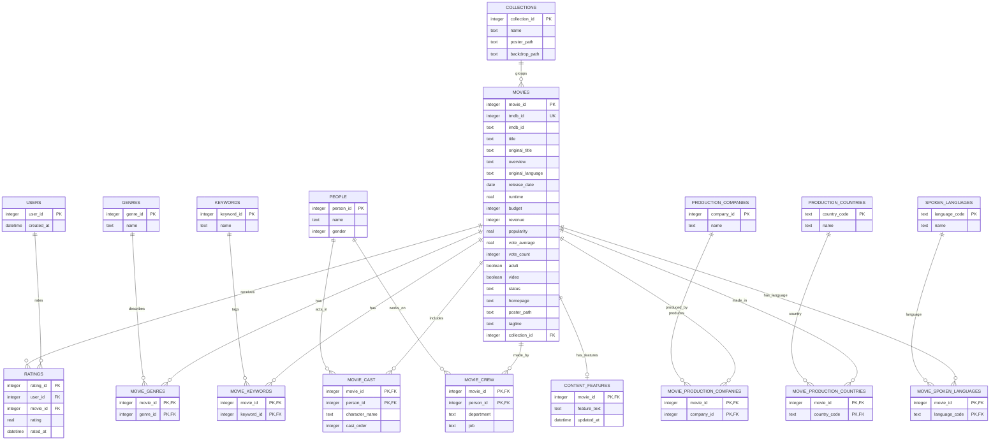

# Задание 1. Архитектура базы данных рекомендательной системы

## 1. Цель базы данных

База данных проектируется для функциональной рекомендательной системы фильмов на основе датасета `The Movies Dataset`, который лежит в `Lab_5/datasets/`.

Система должна поддерживать три будущих сценария:

1. Content-Based Filtering: рекомендации похожих фильмов по жанрам, ключевым словам, описанию, актерам, режиссерам и другим атрибутам.
2. Collaborative Filtering: рекомендации на основе оценок пользователей.
3. Hybrid Methods: объединение контентных признаков фильма и пользовательских рейтингов.

Для первого этапа выбрана нормализованная реляционная структура. Она уменьшает дублирование, делает связи между сущностями явными и упрощает построение признаков для рекомендательных моделей.

## 2. Используемые CSV-файлы

| Файл | Назначение | Основные поля |
|---|---|---|
| `movies_metadata.csv` | Метаданные фильмов | `id`, `title`, `overview`, `genres`, `release_date`, `runtime`, `vote_average`, `vote_count` |
| `links.csv` / `links_small.csv` | Связь MovieLens, IMDb и TMDB идентификаторов | `movieId`, `imdbId`, `tmdbId` |
| `ratings.csv` / `ratings_small.csv` | Оценки пользователей | `userId`, `movieId`, `rating`, `timestamp` |
| `keywords.csv` | Ключевые слова фильмов | `id`, `keywords` |
| `credits.csv` | Актеры и съемочная группа | `id`, `cast`, `crew` |

Для разработки и проверки ETL можно использовать `ratings_small.csv`, а для итоговой загрузки - полный `ratings.csv`.

## 3. Основные сущности

### `users`

Пользователи рекомендательной системы. В исходных данных пользователи представлены только идентификатором из таблицы рейтингов.

| Поле | Тип | Описание |
|---|---|---|
| `user_id` | INTEGER PK | Идентификатор пользователя MovieLens |
| `created_at` | DATETIME | Дата добавления пользователя в БД |

### `movies`

Основная таблица объектов рекомендации.

| Поле | Тип | Описание |
|---|---|---|
| `movie_id` | INTEGER PK | Внутренний ID MovieLens |
| `tmdb_id` | INTEGER UNIQUE | ID фильма в TMDB |
| `imdb_id` | TEXT | ID фильма в IMDb |
| `title` | TEXT | Название фильма |
| `original_title` | TEXT | Оригинальное название |
| `overview` | TEXT | Описание фильма |
| `original_language` | TEXT | Язык оригинала |
| `release_date` | DATE | Дата выхода |
| `runtime` | REAL | Длительность в минутах |
| `budget` | INTEGER | Бюджет |
| `revenue` | INTEGER | Сборы |
| `popularity` | REAL | Популярность из TMDB |
| `vote_average` | REAL | Средняя оценка из TMDB |
| `vote_count` | INTEGER | Количество оценок TMDB |
| `adult` | BOOLEAN | Признак adult-контента |
| `video` | BOOLEAN | Признак видео |
| `status` | TEXT | Статус релиза |
| `homepage` | TEXT | Сайт фильма |
| `poster_path` | TEXT | Путь к постеру |
| `tagline` | TEXT | Слоган |
| `collection_id` | INTEGER FK | Коллекция/франшиза |

### `ratings`

Факты взаимодействия пользователя с фильмом. Это ключевая таблица для коллаборативной фильтрации.

| Поле | Тип | Описание |
|---|---|---|
| `rating_id` | INTEGER PK | Технический идентификатор |
| `user_id` | INTEGER FK | Пользователь |
| `movie_id` | INTEGER FK | Фильм |
| `rating` | REAL | Оценка пользователя |
| `rated_at` | DATETIME | Время оценки |

Ограничение: одна оценка пользователя на один фильм, `UNIQUE(user_id, movie_id)`.

### Справочники и связи для контентных признаков

| Таблица | Назначение |
|---|---|
| `genres` | Справочник жанров |
| `movie_genres` | Связь многие-ко-многим между фильмами и жанрами |
| `keywords` | Справочник ключевых слов |
| `movie_keywords` | Связь фильмов и ключевых слов |
| `people` | Актеры, режиссеры, сценаристы и другие участники |
| `movie_cast` | Актерский состав фильма |
| `movie_crew` | Съемочная группа фильма |
| `collections` | Франшизы и коллекции фильмов |
| `production_companies` | Производственные компании |
| `movie_production_companies` | Связь фильмов и компаний |
| `production_countries` | Страны производства |
| `movie_production_countries` | Связь фильмов и стран |
| `spoken_languages` | Языки фильма |
| `movie_spoken_languages` | Связь фильмов и языков |

### `content_features`

Таблица для подготовленных контентных признаков фильма. Она понадобится на следующих этапах, чтобы не пересчитывать текстовые признаки при каждом запросе рекомендаций.

| Поле | Тип | Описание |
|---|---|---|
| `movie_id` | INTEGER PK/FK | Фильм |
| `feature_text` | TEXT | Объединенный текст: описание, жанры, ключевые слова, актеры, режиссер |
| `updated_at` | DATETIME | Дата обновления признаков |

## 4. ER-диаграмма

ER-диаграмма вынесена в файл [`er_diagram.mmd`](er_diagram.mmd). Ее можно открыть в Mermaid Live Editor, Obsidian, GitHub Markdown или другом инструменте с поддержкой Mermaid.

Ключевая структура:

## 5. Обоснование структуры

1. Таблица `movies` является центральной, потому что фильм - основной объект рекомендации.
2. Таблица `ratings` отделена от фильмов и пользователей, так как это факты взаимодействий. Такая структура позволяет строить матрицу user-item для коллаборативной фильтрации.
3. Жанры, ключевые слова, актеры, съемочная группа, страны, языки и компании вынесены в отдельные справочники, потому что один фильм может иметь много значений каждого типа, а одно значение может относиться ко многим фильмам.
4. Связующие таблицы `movie_genres`, `movie_keywords`, `movie_cast`, `movie_crew` позволяют эффективно строить контентные профили фильмов и искать похожие фильмы.
5. Таблица `content_features` добавлена как подготовленный слой для рекомендательных алгоритмов. Она не заменяет нормализованные таблицы, а хранит результат ETL/feature engineering.
6. Внешние идентификаторы TMDB, IMDb и MovieLens сохраняются, чтобы можно было связывать таблицы между собой и при необходимости обогащать данные из внешних источников.
7. Для практической реализации выбрана PostgreSQL. При этом логическая модель остается переносимой и может быть адаптирована под другие реляционные СУБД без изменения основных сущностей и связей.

## 6. Какие рекомендации поддерживает БД

| Тип рекомендаций | Какие таблицы используются |
|---|---|
| Content-Based Filtering | `movies`, `genres`, `keywords`, `people`, `movie_cast`, `movie_crew`, `content_features` |
| Collaborative Filtering | `users`, `movies`, `ratings` |
| Hybrid Methods | `ratings` + `content_features` + справочники признаков |
| Cold Start для нового фильма | `movies`, `genres`, `keywords`, `people`, `content_features` |
| Cold Start для нового пользователя | популярные фильмы из `ratings`, жанровые предпочтения, первичный опрос |
